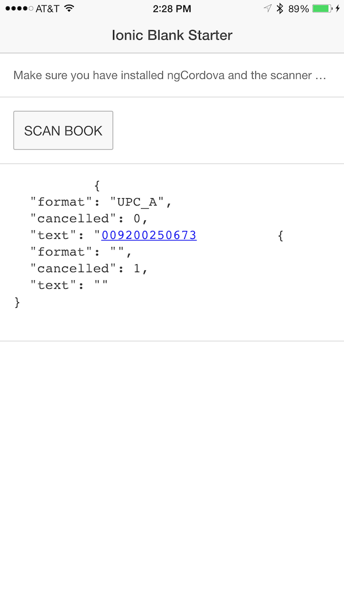

# ionic-scannerTest
Basic ScannerTest using Ionic Framework

Remember to install ngCordova

`ionic add ngCordova`

Remember to install the Scanner Plugin

`cordova plugin add phonegap-plugin-barcodescanner`

## Ionic Video Series - Subscribe on YouTube Channel

